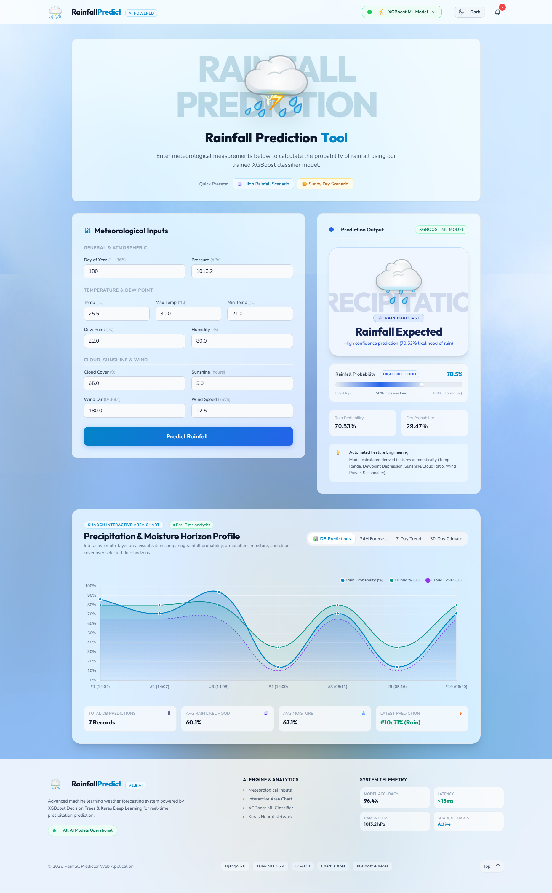
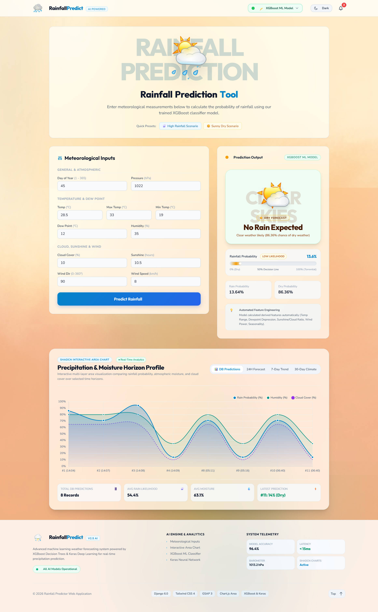

<div align="center">

  

  # Rainfall Predictor & Analytics Platform

  **An Enterprise-Grade Weather Intelligence & Predictive Analytics System Powered by XGBoost, Deep Neural Networks, Django & FastAPI**

  [](https://github.com/DPramuditha/Rainfall-Predictor/actions/workflows/ci.yml)
  [](https://www.python.org/)
  [](https://www.djangoproject.com/)
  [](https://fastapi.tiangolo.com/)
  [](https://xgboost.readthedocs.io/)
  [](https://keras.io/)
  [](https://tailwindcss.com/)
  [](https://greensock.com/gsap/)

  [Key Features](#-key-features) •
  [Screenshots](#-application-screenshots) •
  [Tech Stack](#%EF%B8%8F-tech-stack) •
  [Getting Started](#-getting-started) •
  [API Reference](#-api-reference) •
  [ML Models](#-machine-learning-models) •
  [Testing & CI/CD](#-testing--cicd)

</div>

---

## 📌 Executive Summary

**Rainfall Predictor** is a dual-architecture machine learning web platform designed for accurate binary rainfall prediction and meteorological analysis. By combining classical **Gradient Boosted Trees (XGBoost)** with **Deep Neural Networks (Keras/TensorFlow)**, the system evaluates key atmospheric parameters such as pressure, temperature, dew point, humidity, cloud cover, sunshine, and wind vectors to predict precipitation likelihood with high statistical accuracy.

The system features a **Django 5.0+ web application** offering an interactive glassmorphic UI, real-time prediction forms, model comparison analytics dashboards, and prediction history tracking, paired with an asynchronous **FastAPI ML microservice** for REST API integration and automated OpenAPI/Swagger documentation.

---

## ✨ Key Features

- 🧠 **Dual ML Engine**: Switch between **XGBoost Classifier** (`.joblib`) and **Keras Deep Neural Network** (`.keras`) for inference and probability comparison.
- ⚡ **Dual Server Architecture**:
  - **Django 5.0+ Web Application**: Server-rendered UI with Tailwind CSS v4, GSAP micro-animations, and interactive charts.
  - **FastAPI Microservice**: Asynchronous REST API server running on port `8001` for microservice pipelines.
- 🎲 **Random Weather Preset Generator**: One-click "Random Scenario" generator filling all 11 inputs with physically consistent, randomized meteorological parameters.
- 🗄️ **Interactive Database Records Modal**: Live record counter badge, search filtering, rain/dry condition toggles, single record deletion, and bulk database clear actions.
- 📊 **Interactive Analytics & Dashboard**: Visualize historical prediction records, confidence distributions, and meteorological feature correlations.
- 🌡️ **11 Atmospheric Metrics**: Precision predictions based on Day of Year, Atmospheric Pressure, Temperature (Max/Min/Avg), Dew Point, Relative Humidity, Cloud Cover, Sunshine Hours, Wind Direction, and Wind Speed.
- 🎨 **Modern Glassmorphic UI**: Styled using Tailwind CSS v4, GSAP animations, dynamic atmospheric backgrounds, and animated 3D weather icons.
- 📝 **Automated History & Persistence**: Dual database support (SQLite3 for local dev, PostgreSQL for production) with ORM tracking for all model queries.
- 🧪 **Comprehensive CI/CD & Automated Testing**: Integrated GitHub Actions CI pipeline running 33 automated unit and integration tests via `python run_tests.py`.
- 📖 **Swagger & ReDoc API Docs**: Built-in interactive API playground at `/docs` and `/redoc`.

---

## 📸 Application Screenshots

<div align="center">
  <table>
    <tr>
      <td align="center" width="50%">
        
        <br />
        <sub><b>🌧️ Rainfall Predicted (High Precipitation Risk)</b></sub>
      </td>
      <td align="center" width="50%">
        
        <br />
        <sub><b>☀️ No Rainfall Predicted (Clear Weather / Fair Conditions)</b></sub>
      </td>
    </tr>
  </table>
</div>

---

## 🛠️ Tech Stack

| Category | Technology | Description |
| :--- | :--- | :--- |
| **Primary Framework** | [Django 5.0+](https://www.djangoproject.com/) | Web application framework handling UI rendering, ORM, and admin |
| **Microservice Framework** | [FastAPI](https://fastapi.tiangolo.com/) | Async REST API engine for machine learning microservices |
| **Machine Learning** | [XGBoost](https://xgboost.readthedocs.io/) | Extreme Gradient Boosting classifier |
| **Deep Learning** | [Keras](https://keras.io/) / [TensorFlow](https://www.tensorflow.org/) | Sequential Deep Neural Network for probability modeling |
| **Data Processing** | [Scikit-learn](https://scikit-learn.org/), [Pandas](https://pandas.pydata.org/), [NumPy](https://numpy.org/) | Scaler preprocessing, matrix calculations, and feature transformation |
| **Front-End Styling** | [Tailwind CSS v4](https://tailwindcss.com/) | Modern utility-first CSS engine built via `@tailwindcss/cli` |
| **UI Animations** | [GSAP 3.12+](https://greensock.com/gsap/), [Lottie Web](https://airbnb.io/lottie/) | High-performance interactive UI animations |
| **Database** | SQLite3 / PostgreSQL | Relational storage for prediction history and model telemetry |
| **Continuous Integration** | [GitHub Actions](https://github.com/features/actions) | Automated test suite workflow runner with PostgreSQL service |
| **API Documentation** | OpenAPI 3.0 / Swagger UI / ReDoc | Interactive API testing documentation |

---

## 📂 Project Structure

```text
rainfall_predictor/
│
├── .github/                              # GitHub Configuration & CI/CD Pipelines
│   └── workflows/
│       └── ci.yml                        # GitHub Actions automated test workflow
│
├── api/                                  # FastAPI ML Microservice
│   └── main.py                           # Async FastAPI endpoints & OpenAPI routing
│
├── models/                               # Pre-trained Machine Learning Artifacts
│   ├── xgboost_model.joblib              # Serialized XGBoost Classifier
│   ├── neural_network_model.keras        # Keras Deep Neural Network Model
│   └── Binary_Prediction_with_Rainfall_Dataset.ipynb  # ML Training & Analysis Notebook
│
├── predictor/                            # Django Main Application
│   ├── migrations/                       # Database schema migrations
│   ├── tests/                            # Modular Automated Test Suite (33 Tests)
│   │   ├── test_models.py                # Django ORM & RainfallPrediction tests
│   │   ├── test_views.py                 # View controller & prediction flow tests
│   │   ├── test_urls.py                  # URL dispatcher & route resolution tests
│   │   ├── test_ml_model.py              # ModelLoader & feature engineering tests
│   │   └── test_fastapi.py               # FastAPI microservice endpoint tests
│   ├── static/
│   │   ├── css/
│   │   │   ├── input.css                 # Tailwind source stylesheet
│   │   │   └── output.css                # Compiled production CSS
│   │   ├── js/
│   │   │   └── main.js                   # UI logic, chart rendering & presets
│   │   └── images/                       # Animated 3D weather icons & graphics
│   ├── templates/
│   │   ├── base.html                     # Main layout shell with GSAP & Tailwind
│   │   └── predictor/
│   │       └── index.html                # App homepage & prediction form UI
│   ├── ml_model.py                       # Unified ModelLoader & preprocessing engine
│   ├── models.py                         # RainfallPrediction database schema
│   ├── urls.py                           # App route definitions
│   └── views.py                          # Prediction controllers & DB handlers
│
├── rainfall_project/                     # Django Core Project Settings
│   ├── settings.py                       # Core settings & DB configurations
│   ├── urls.py                           # Root URL dispatcher
│   └── wsgi.py / asgi.py                 # Application server gateways
│
├── .env.example                          # Environment variables configuration template
├── .gitignore                            # Version control exclusion rules
├── db.sqlite3                            # Local development database
├── manage.py                             # Django CLI management script
├── package.json                          # Node.js dependencies for Tailwind & GSAP
├── requirements.txt                      # Python dependency specification
├── run_fastapi.py                        # FastAPI microservice startup runner
└── run_tests.py                          # Formatted test runner script with DB cleanup
```

---

## 🚀 Getting Started

### 1. Prerequisites

Ensure you have the following installed on your host system:
- **Python**: `v3.10` or higher
- **Node.js**: `v18.0` or higher (npm `v9+`)
- **Git**: Latest version

---

### 2. Repository Cloning & Environment Setup

```bash
# Clone the repository
git clone https://github.com/DPramuditha/Rainfall-Predictor.git
cd rainfall_predictor

# Create a Python virtual environment
python -m venv venv

# Activate virtual environment
# Windows (PowerShell):
.\venv\Scripts\activate
# Linux / macOS:
source venv/bin/activate
```

---

### 3. Install Dependencies

```bash
# Install Python packages
pip install --upgrade pip
pip install -r requirements.txt

# Install Node.js packages for Tailwind CSS v4 & GSAP
npm install
```

---

### 4. Environment Variables Configuration

Copy `.env.example` to create your local `.env` configuration file:

```bash
# Copy template file
cp .env.example .env
```

*Default `.env` settings:*
```env
# --- Django Core Settings ---
SECRET_KEY=your-custom-secret-key-here
DEBUG=True
ALLOWED_HOSTS=127.0.0.1,localhost

# --- PostgreSQL Database Configuration (Optional) ---
USE_POSTGRES=false
DB_ENGINE=postgresql
DB_NAME=rainfall_db
DB_USER=postgres
DB_PASSWORD=postgres
DB_HOST=localhost
DB_PORT=5432

# --- FastAPI ML Microservice Configuration ---
FASTAPI_URL=http://127.0.0.1:8001/api/v1/predict
FASTAPI_HOST=127.0.0.1
FASTAPI_PORT=8001
```

---

### 5. Front-End Styles Compilation

Build the compiled Tailwind CSS stylesheet:

```bash
# One-time CSS production build
npm run build:css

# (Optional) Watch mode for active development
npm run watch:css
```

---

### 6. Database Migrations

Initialize the local SQLite (or PostgreSQL) database tables:

```bash
python manage.py migrate
```

---

## 💻 Running the Application

### Option A: Running Django Web Application (Port 8000)

Starts the primary web platform with interactive UI, prediction forms, and analytics:

```bash
python manage.py runserver
```
📍 **Access UI**: `http://127.0.0.1:8000/`

---

### Option B: Running FastAPI ML Microservice (Port 8001)

Starts the standalone async REST API microservice:

```bash
python run_fastapi.py
```
📍 **Microservice Root**: `http://127.0.0.1:8001/`  
📖 **Interactive Swagger Docs**: `http://127.0.0.1:8001/docs`  
📖 **ReDoc Documentation**: `http://127.0.0.1:8001/redoc`

---

### Option C: 🐳Running with Docker & Docker Compose (Recommended for Containerization)

#### Using Docker Compose (Full Stack with PostgreSQL + FastAPI + Django):

```bash
# Build and launch all services in detached mode
docker compose up --build -d
```
📍 **Django UI**: `http://localhost:8000/`  
📍 **FastAPI Microservice**: `http://localhost:8001/`  
📖 **Swagger API Docs**: `http://localhost:8001/docs`

#### Using Standalone Dockerfile:

```bash
# Build Docker image
docker build -t rainfall-predictor .

# Run both Django & FastAPI in a single container
docker run -p 8000:8000 -p 8001:8001 rainfall-predictor
```

---

## 📊 Machine Learning Models & Features

### 🌤️ Input Meteorological Features

| Feature Name | Key | Range / Unit | Description |
| :--- | :--- | :--- | :--- |
| **Day of Year** | `day` | `1 - 365` | Calendar day number |
| **Atmospheric Pressure** | `pressure` | `800 - 1100 hPa` | Barometric sea-level pressure |
| **Maximum Temperature** | `maxtemp` | °C | Peak daily temperature |
| **Average Temperature**| `temparature`| °C | Mean daily temperature |
| **Minimum Temperature** | `mintemp` | °C | Lowest daily temperature |
| **Dew Point** | `dewpoint` | °C | Temperature at which air reaches saturation |
| **Relative Humidity** | `humidity` | `0 - 100 %` | Water vapor percentage in air |
| **Cloud Cover** | `cloud` | `0 - 100 %` | Sky coverage fraction |
| **Sunshine Duration** | `sunshine` | `0 - 24 hrs` | Direct sunshine hours per day |
| **Wind Direction** | `winddirection`| `0 - 360 °` | Compass heading of wind origin |
| **Wind Speed** | `windspeed` | `km/h` | Surface wind velocity |

### 🤖 Model Performance Comparison

- **XGBoost Classifier**: Optimized gradient boosting trees model (`xgboost_model.joblib`), trained on historical meteorological records. Provides fast inference times and robust feature importance weighting.
- **Keras Deep Neural Network**: Multi-layer dense neural network (`neural_network_model.keras`) trained with dropout regularization and ReLU activations for continuous probability estimations.

---

## 🌐 API Reference

### 1. Predict Rainfall (POST)

**Endpoint**: `/api/v1/predict`  
**Method**: `POST`  
**Content-Type**: `application/json`

#### Request Payload Example:
```json
{
  "day": 180,
  "pressure": 1013.2,
  "maxtemp": 30.0,
  "temparature": 25.5,
  "mintemp": 21.0,
  "dewpoint": 22.0,
  "humidity": 80.0,
  "cloud": 65.0,
  "sunshine": 5.0,
  "winddirection": 180.0,
  "windspeed": 12.5,
  "model_choice": "xgboost"
}
```

#### Response Example:
```json
{
  "prediction": 1,
  "will_rain": true,
  "rain_probability": 87.45,
  "no_rain_probability": 12.55,
  "model_used": "xgboost",
  "model_display_name": "XGBoost Classifier"
}
```

---

### 2. Historical Predictions (GET)

**Endpoint**: `/api/v1/predictions` or `/api/predictions/`  
**Method**: `GET`

#### Response Example:
```json
{
  "success": true,
  "count": 1,
  "predictions": [
    {
      "id": 1,
      "day": 180,
      "pressure": 1013.2,
      "temparature": 25.5,
      "humidity": 80.0,
      "will_rain": true,
      "rain_probability": 87.45,
      "model_display_name": "XGBoost Classifier",
      "created_at": "2026-07-31 15:30:00"
    }
  ]
}
```

---

### 3. Delete Single Prediction Record (DELETE)

**Endpoint**: `/api/predictions/delete/{id}/`  
**Method**: `POST` or `DELETE`

#### Response Example:
```json
{
  "success": true,
  "message": "Prediction #1 deleted successfully."
}
```

---

### 4. Clear All Prediction Records (DELETE)

**Endpoint**: `/api/predictions/delete/`  
**Method**: `POST` or `DELETE`

#### Response Example:
```json
{
  "success": true,
  "message": "Cleared 15 prediction records."
}
```

---

## 🧪 Testing & CI/CD

### Local Test Execution

Run the custom test suite runner for formatted test reports and safe PostgreSQL database cleanup:

```bash
# Recommended Custom Test Runner (Runs all 33 modular tests)
python run_tests.py

# Standard Django Test Runner
python manage.py test
```

### GitHub Actions CI Pipeline

The project includes an automated **GitHub Actions CI Workflow** ([ci.yml](file:///.github/workflows/ci.yml)) triggered on:
- Pushes to `main` and `develop` branches
- Pull Requests targeted at `main` and `develop` branches

**Workflow Execution Steps:**
- Provisions a **PostgreSQL 15** database container service.
- Installs Python 3.11 and dependencies.
- Executes `python run_tests.py` with PostgreSQL environment settings before code is merged into `main`.

---

<div align="center">

  [⬆ Back to Top](#-rainfall-predictor--analytics-platform)

</div>

